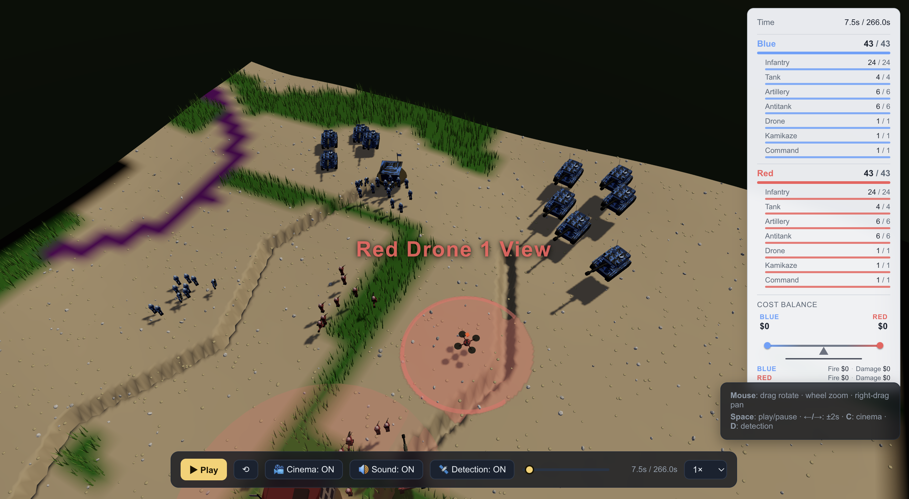

# Wargame

Python 기반 워게임 시뮬레이션과 지형 데이터 생성 도구를 함께 보관한 저장소입니다.

---

## 목적

전장 단위의 분대 ~ 대대 규모 교전을 **이산사건 시뮬레이션(Discrete Event Simulation)** 으로 재현해 정량적으로 분석하기 위한 도구입니다.

- **운용 분석**: 부대 배치, 사격 우선순위, Phase 전환 조건 등 작전 결정 변수를 바꿔가며 결과를 비교
- **시나리오 비교**: 실제 지형(Vuhledar)·실제 도로/참호 레이어 위에서 다른 편성·다른 자산 구성의 효과 측정
- **데이터 생성**: 매 tick(시뮬레이션 1초)마다 모든 유닛의 위치·상태·이벤트와 팀별 비용을 CSV로 출력 → 후속 분석/시각화/ML 학습용 데이터로 활용
- **재현성**: 모든 하이퍼파라미터(유닛 능력치, 명중·살상 확률, 작전단계, 지형 효과, 비용)가 `config.yaml` 한 곳에 모여 코드 수정 없이 실험 가능

부수 목표로, 시각화(영상)와 헤드리스(고속 데이터 수집)를 같은 코드베이스에서 지원합니다.

---

## 구성

```text
wargame/
├── war-game-modeling/          # Pygame 기반 워게임 시뮬레이션
│   ├── simulation.py           # 메인 오케스트레이터 (이벤트 루프, CSV/money 출력, headless, 조기종료)
│   ├── config.yaml             # 모든 하이퍼파라미터 (유닛/지형/확률/작전/자금 등)
│   ├── model/                  # 도메인 모듈 (아래 "모듈 구성" 참조)
│   ├── database/               # 배경 이미지, DEM, 지형 레이어(참호/도로/하천) CSV, 사운드
│   └── results/                # 실행 결과물 (simulation.csv, money.csv, simulation.mp4) — gitignore
├── vuhledar_terrain_project/   # Vuhledar AOI 지형 격자 생성 도구
│   └── build_vuhledar_terrain.py
├── requirements.txt            # 루트 통합 Python 의존성
└── README.md
```

---

## 시뮬레이션 아키텍처

### 이산사건 시뮬레이션 (DES)

전장의 변화를 **시간 순서로 정렬된 이벤트(Event)** 의 처리로 모델링합니다.

- **시간 모델**: `current_time`이 `sim_speed`(기본 1.0초)씩 증가하는 fixed-time-step
- **이벤트 큐(FEL, Future Event List)**: `heapq`로 구현된 우선순위 큐. 각 이벤트는 `(time, event_type, source_id, target_id, position, data)` 튜플
- **이벤트 유형**: `MOVE`(이동 완료), `FIRE`(사격 발사) 두 가지
- **처리 순서**: 매 tick 시작 시 `event.time ≤ current_time`인 모든 이벤트를 pop → 처리 → 결과 상태 반영 → 다음 사격/이동 이벤트를 다시 큐에 푸시

### 단위와 상태

- **유닛 7종**: `RIFLE`(보병), `ANTI_TANK`(대전차), `TANK`(전차), `ARTILLERY`(포병), `DRONE`(정찰드론), `SELF_DEST_DRONE`(자폭드론), `COMMAND_POST`(지휘소)
- **상태(Status)**: 차량/드론 계열은 `ALIVE / M_KILL / F_KILL / MF_KILL / K_KILL`, 보병 계열은 `ALIVE / MINOR / SERIOUS / CRITICAL / FATAL`
- **CSV에서는 통일된 5단계 kill 분류** (`alive / m_kill / f_kill / mf_kill / k_kill`)로 환산되어 출력

### 작전 통제 (Command / Phase)

각 팀(RED, BLUE)은 `Command` 객체를 보유:
- 현재 `phase` (Deep_fires / Degrade_enemy_forces / CLOSE_COMBAT)
- `TAI` — 드론 정찰 지점
- `fire_priority` — 포병의 표적 우선순위
- `maneuver_objective` — 부대 기동 목표

지휘소가 매 tick 상황을 평가해 결심조건(예: 적 포병 4대 격파)이 충족되면 다음 Phase로 전환.

### 지형 모델 (Layered Terrain)

`config.yaml`에 명시된 격자 파일 4종을 로드:
- `vuhledar_elevation.csv` — DEM 고도 (m)
- `vuhledar_river_mask.csv` — 하천 마스크 (bool)
- `vuhledar_road_type.csv` — 도로 종류
- `vuhledar_trench_mask.csv` — 참호 마스크 (bool)

각 셀에 대해 `get_terrain_type`이 **우선순위 river → trench → road → mountain → normal** 로 분류하고, 각 지형 종류에 대해 4개 배율(`mobility / visibility / hit_probability / damage_probability`)이 정의됩니다. 산악·참호는 차폐(DS/DM) 방호 상태로 판정됩니다.

### 자금 추적 (Money)

`MoneyTracker`가 팀별 두 누적값을 유지:
- `fire_cost` — 사격할 때 무기 종류에 따른 비용 부과
- `damage_cost` — 피해를 입었을 때 유닛 가치 × 상태 악화 비율로 비용 부과

매 tick 그 누적값이 `money.csv`에 스냅샷으로 저장됩니다 (RED, BLUE 각 한 행씩).

---

## 메인 루프 흐름

`simulation.py`의 `run_simulation()` 한 번 반복(=1 tick)이 처리하는 단계:

```
while current_time < max_time:
  ┌─ (1) pygame 입력 처리 (headless 아닐 때, 일시정지/종료 키)
  │
  ├─ (2) 현재 시간에 발생할 모든 이벤트를 FEL에서 pop
  │       └─ current_events = [Event(...), ...]
  │
  ├─ (3) 각 이벤트 처리
  │       ├─ MOVE → unit.update_position(event.position)
  │       ├─ FIRE → fire.fire(attacker, target, ...) → 피해 판정 + 상태 변경
  │       │         (자폭드론이면 자기 자신도 K_KILL)
  │       └─ 이벤트 처리 후, 모든 유닛에 대해:
  │           - 탐지 갱신 (clear_targets → detect.update_detection)
  │           - 팀별 정보 공유 (detect.share_info)
  │           - 사격 가능 타겟 갱신 (fire.update_eligible_targets)
  │
  ├─ (4) 지휘소 상황평가 → Phase 전환 결심 → maneuver_objective 갱신
  │
  ├─ (5) 다음 사격/이동 이벤트 예약 (FEL에 push)
  │       - 사격 가능 유닛이 표적 있으면 FIRE 이벤트 스케줄
  │       - 이동 가능 유닛은 다음 1초 후 위치로 MOVE 이벤트 스케줄
  │
  ├─ (6) CSV 기록 (_record_tick)
  │       ├─ 모든 유닛 1행씩 (simulation.csv)
  │       └─ 팀별 누적 자금 2행 (money.csv)
  │
  ├─ (7) 조기 종료 검사 (_check_termination)
  │       - 한 팀의 전투 유닛이 사격 불가 상태로 모두 전환되면 winner 선언 후 break
  │
  ├─ (8) 시각화 프레임 렌더링 (visualizer가 활성일 때만)
  │       - 헤드리스 + record_video: 프레임만 저장 (sleep 없음 → 고속)
  │       - 비-headless: 화면 표시 + 실시간 sleep
  │
  └─ (9) current_time += sim_speed

종료 후:
  - _save_csv()      → simulation.csv + money.csv 디스크 저장
  - 비디오 활성 시   → ffmpeg로 frames/ → mp4 합성
  - 마지막에 print_money_summary로 팀별 총 비용 출력
```

---

## 모듈 구성

`model/` 디렉토리의 각 파일은 특정 도메인 책임을 담당하며 서로 약한 결합으로 협력합니다.

| 파일 | 책임 | 핵심 클래스/함수 | 의존 |
|---|---|---|---|
| `unit.py` | 유닛 dataclass + 열거형 정의 (Team/UnitType/Status/Action), config에서 유닛별 능력치 로드, `can_move/can_fire`, `update_position`(yaw 자동 추적) | `Unit`, `Team`, `UnitType`, `Status`, `Action` | `event.py` |
| `event.py` | 이벤트 타입과 FEL 헬퍼 | `Event`, `EventType`, `EventQueue` | — |
| `terrain.py` | DEM + 참호/도로/하천 마스크 로드, 지형 분류, 지형별 4개 배율 제공 (`get_terrain_decay_rate / get_visibility_multiplier / get_hit_probability_multiplier / get_damage_probability_multiplier`) | `Terrain` | `unit.py` |
| `detect.py` | LOS 체크 (DEM 샘플링), 거리·피탐지성·시야배율 기반 탐지 판정, 지휘소를 통한 정보 공유 | `Detect` | `unit.py`, `terrain.py`, `function.py` |
| `probabilities.py` | `config['probabilities']`의 테이블을 DataFrame으로 빌드, 거리·방호상태로 명중/살상확률 선형 보간 | `ProbabilitySystem` | `unit.py` |
| `fire.py` | 사격 가능 표적 후보 산출, 포병 우선순위 기반 표적 선정, 직사·곡사 사격 처리 (탄착점 분산, Gaussian 피해 함수), 자폭드론 특수 처리, 자금 훅(`MoneyTracker`) 호출 | `Fire` | `unit.py`, `event.py`, `command.py`, `detect.py`, `terrain.py`, `probabilities.py`, `function.py`, `money.py` |
| `movement.py` | 유닛 이동 (직선) + 드론 정찰 격자(3×3 TAI 순회) + 지형 감속 적용. 속도/격자 크기 모두 config | `Movement` | `unit.py`, `event.py`, `command.py`, `terrain.py`, `function.py` |
| `command.py` | `Command` dataclass (팀별 Phase 상태), 결심조건 평가(`evaluate_situation`), Phase 전환(`_update_phase`), config의 `phases` 섹션을 파싱 | `Command`, `Phase`, `LogHandler` | `unit.py` |
| `money.py` | 팀별 누적 비용(`fire_cost`, `damage_cost`) 추적, 무기 종류별 사격 비용 / 유닛 가치 × 상태 변화 비율로 산출 | `MoneyTracker` | `unit.py` |
| `visualization.py` | Pygame 렌더링 (배경, 유닛 심볼, 탐지선/사격선/사격가능선, 패널, 사운드), 프레임 PNG 저장, ffmpeg 비디오 합성. 한글 폰트 자동 탐지 | `Visualizer` | `unit.py`, `terrain.py`, `fire.py`, `event.py`, `function.py` |
| `function.py` | 유닛/좌표 간 유클리드 거리 헬퍼 | `calculate_distance`, `calculate_point_distance` | `unit.py` |

`simulation.py`는 위 모듈들을 조립해 시간 진행과 I/O(CSV/영상/콘솔)를 담당하는 오케스트레이터입니다.

### 결합도 요약

```
            ┌─────────────────┐
            │  simulation.py  │  ← 메인 오케스트레이터
            └────────┬────────┘
                     │
   ┌─────────────────┼─────────────────┐
   │                 │                 │
   ▼                 ▼                 ▼
Visualizer       Fire/Movement/      Command
   │              Detect              │
   │                 │                │
   └──────┬──────────┴──────┬─────────┘
          ▼                 ▼
       Terrain         Probabilities + MoneyTracker
          │                 │
          ▼                 ▼
         Unit (+ Event, function)
```

- 위쪽일수록 상위 책임 (제어, 시각화)
- 아래로 갈수록 데이터/순수 함수 위주
- 모든 모듈이 `config.yaml`을 직접 로드해 자기 영역의 하이퍼파라미터를 가져옵니다 (DI 없이 module-load-time에 한 번 로드)

---

## 데이터 흐름

```
config.yaml ──┐
              ├──→ 각 모듈이 import 시점에 자기 섹션을 읽음
              │       (units, phases, terrain, probabilities, money, ...)
              │
              ▼
   ┌────────────────────────┐
   │  Simulation.__init__   │  ← 유닛 생성, 컴포넌트 조립, 초기 이벤트 스케줄
   └──────────┬─────────────┘
              │
              ▼
   ┌────────────────────────┐
   │   run_simulation 루프  │
   │   (위 "메인 루프 흐름" 참조) │
   └──────────┬─────────────┘
              │
   ┌──────────┴─────────────────┐
   ▼                            ▼
 results/simulation.csv       results/simulation.mp4
 results/money.csv            (frames/*.png 합성)
```

`config.yaml`은 코드와 분리된 **시뮬레이션 사양**이며, 다른 시나리오를 돌리려면 이 파일만 바꾸면 됩니다.

---

## 프로젝트 요약

### `war-game-modeling`

RED/BLUE 양측 부대가 전장에서 이동, 탐지, 사격, 피해 판정을 수행하는 Pygame 기반 시뮬레이션입니다.

주요 기능:

- 전차, 대전차, 포병, 정찰 드론, **자폭 드론(SELF_DEST_DRONE)**, 보병, 지휘소 단위 모델링
- 탐지선, 사격선, 유효 표적선 시각화 옵션
- **layered terrain**: 고도 + 참호/도로/하천 마스크, 지형별 이동·시야·명중·피해 배율
- **자금(money) 추적**: 사격 비용 + 피해 비용을 팀별로 집계하고 매 tick CSV 저장
- **전면 config 기반**: 유닛 능력치, 명중/살상 확률, 작전단계(Phase), 지형, 자금 등 모든 하이퍼파라미터를 `config.yaml`에서 관리 (코드 수정 불필요)
- **CSV 결과 로깅**: 매 tick 모든 유닛 상태를 시간순 CSV로 저장 (아래 스키마 참조)
- **headless 모드**: 창·실시간 페이싱 없이 고속 실행 (데이터 수집용)
- **조기 종료**: 한 팀의 전투 가능 유닛이 0이 되면 승자 판정 후 종료
- 한글 라벨 폰트(Noto Sans CJK KR) 지원

### `vuhledar_terrain_project`

Vuhledar 주변 AOI에 대해 OpenStreetMap 데이터와 DEM을 활용하여 워게임용 지형 격자를 생성합니다.

주요 기능:

- OSM 도로, 건물, 토지이용, 자연 지형, 수계, 철도 레이어 다운로드
- Copernicus DEM 기반 고도, 경사도, hillshade 처리
- 50m 기본 격자 생성 및 지형 유형/이동 계수/은폐 계수 산출
- GeoPackage, CSV, PNG, HTML 지도 출력

기본 AOI:

```text
south=47.64
west=37.05
north=47.92
east=37.45
CRS=EPSG:32637
```

---

## 설치

Python 3.10 이상을 권장합니다.

Windows PowerShell:

```powershell
python -m venv .venv
.\.venv\Scripts\activate
python -m pip install --upgrade pip
python -m pip install -r requirements.txt
```

Linux/macOS:

```bash
python -m venv .venv
source .venv/bin/activate
python -m pip install --upgrade pip
python -m pip install -r requirements.txt
```

영상 생성을 사용하려면 시스템 `ffmpeg`가 필요합니다.

---

## 실행

### 워게임 시뮬레이션

```powershell
cd war-game-modeling
python simulation.py
```

옵션 예시:

```powershell
python simulation.py --time-scale 2.0 --sim_speed 1.0 --detection T --eligible_TL T --fire T
```

데이터 수집(고속, 창 없음):

```bash
# Linux 서버 등 디스플레이가 없을 때 SDL_VIDEODRIVER=dummy 권장
SDL_VIDEODRIVER=dummy python simulation.py --headless --no-video --max-time 600 --no-hold
```

주요 옵션:

- `--time-scale`: 영상/시각화 시간 스케일
- `--sim_speed`: 시뮬레이션 속도 (tick당 시간 진행량)
- `--detection`: 탐지선 표시 여부 (`T` 또는 `F`)
- `--eligible_TL`: 사격 가능 표적선 표시 여부 (`T` 또는 `F`)
- `--fire`: 사격선 표시 여부 (`T` 또는 `F`)
- `--headless`: 창·실시간 페이싱 끄고 고속 실행 (CSV/영상은 그대로 생성)
- `--no-video`: 이번 실행에서 영상 녹화 비활성화
- `--max-time`: `config.yaml`의 `max_time`을 명령행에서 덮어쓰기
- `--no-hold`: 종료 시 창을 닫고 즉시 종료 (배치 실행용)

시뮬레이션 세부 값은 `war-game-modeling/config.yaml`에서 조정합니다.

---

## 출력 데이터

### `results/simulation.csv` — 매 tick 유닛 상태

`config.yaml`의 `csv.enabled: true`이면 매 tick마다 모든 유닛 상태가 `csv.output_path`(기본 `results/simulation.csv`)에 시간순으로 기록됩니다.

| 컬럼 | 설명 |
|---|---|
| `timestamp` | 시뮬레이션 시간 (초) |
| `team` | `red` / `blue` |
| `agent_type` | `infantry`/`tank`/`artillery`/`antitank`/`drone`/`self_dest_drone`/`command_post` |
| `agent_id` | 유닛 고유 ID (예: `blue_tnk_1`) |
| `x`, `y`, `z` | 위치 (m). `y`=고도, `x`/`z`=평면 좌표 |
| `yaw` | 진행 방향(heading, radian) |
| `alive` | 상태 분류: `alive`/`m_kill`/`f_kill`/`mf_kill`/`k_kill` |
| `event` | 해당 tick의 이벤트 (예: `fire`) |
| `target` | 이벤트 대상 유닛의 `agent_id` |

### `results/money.csv` — 매 tick 팀별 누적 비용

`csv.money_output_path`(기본 `results/money.csv`)에 저장. RED, BLUE 각 한 행씩.

| 컬럼 | 설명 |
|---|---|
| `timestamp` | 시뮬레이션 시간 (초) |
| `team` | `red` / `blue` |
| `fire_cost` | 누적 사격 비용 (해당 팀이 발사한 횟수·무기 종류 기준) |
| `damage_cost` | 누적 피해 비용 (해당 팀 유닛이 입은 손상 × 유닛 가치) |
| `total` | `fire_cost + damage_cost` |

### `results/simulation.mp4` — 시각화 영상

`video.enabled: true`이면 시뮬레이션 중 매 프레임을 `frames/`에 PNG로 저장한 뒤 종료 시 ffmpeg로 mp4를 합성합니다 (`video.output_path`, `video.fps`).

---

## 조기 종료 기준

매 tick 평가하여, 한 팀의 **전투 유닛(`simulation.combat_unit_types`, 기본 보병/대전차/전차/포병)** 중 사격 가능한 유닛이 0이 되면 그 팀이 패배하고 시뮬레이션이 즉시 종료됩니다. 아무도 못 이기면 `max_time`까지 진행합니다.

`can_fire()`는 상태가 `ALIVE / MINOR / M_KILL`인 경우 True. 즉 SERIOUS/CRITICAL/FATAL/F_KILL/MF_KILL/K_KILL은 사격 불가로 간주됩니다.

---

## `config.yaml`에서 관리하는 항목

모든 튜닝 가능한 값이 `config.yaml` 한 곳에 모여 있어 코드 수정 없이 실험할 수 있습니다.

| 섹션 | 내용 |
|---|---|
| `simulation` | 픽셀-미터 스케일, 맵 크기, 치사반경, 드론 고도, 산악 탐지확률, 전투유닛 타입 |
| `scaling` | 사거리/속도 변환 보정 계수 |
| `detection` | LOS 샘플 간격 |
| `fire` | 포병 공산오차, 방호 판정 지형 |
| `probabilities` | **명중/살상 확률 테이블** (거리 × 방호상태) — 구 `database/*.csv`에서 이전 |
| `movement` / `drone` | 이동·도달 거리, 드론 정찰 격자/주기/순회 패턴 |
| `units` | 유닛별 탐지·사거리·피탐지성·속도·사격간격 |
| `phases` / `phase_transitions` | 팀·단계별 TAI/사격우선순위/기동목표, 단계 전환 조건 |
| `terrain` | layered terrain 파일 경로 및 지형별 이동/시야/명중/피해 배율 |
| `money` | 사격 비용, 유닛 가치, 상태별 피해 비율 |
| `video` / `csv` | 영상·CSV 출력 설정 (`csv.output_path`, `csv.money_output_path` 포함) |

---

## Vuhledar 지형 데이터 생성

```powershell
cd vuhledar_terrain_project
python build_vuhledar_terrain.py
```

AOI나 격자 크기를 바꿔 실행할 수도 있습니다.

```bash
python build_vuhledar_terrain.py --south 47.64 --west 37.05 --north 47.92 --east 37.45 --cell-size 50 --output-dir outputs
```

DEM 파일을 직접 지정하려면:

```powershell
python build_vuhledar_terrain.py --dem-path C:\path\to\dem.tif
```

---

## 출력물

`war-game-modeling` 실행 시:

- `frames/`: 영상 저장용 프레임 (mp4 합성 후 정리)
- `results/simulation.csv`: 매 tick 유닛 상태
- `results/money.csv`: 매 tick 팀별 누적 비용
- `results/simulation.mp4`: 시각화 영상

`vuhledar_terrain_project` 실행 시:

- `data_raw/`: OSM/DEM 원천 데이터
- `data_processed/`: 처리된 DEM, 경사도, 지형 격자
- `outputs/`: PNG/HTML 지도와 검증 리포트

이 출력물들은 용량이 커질 수 있어 루트 `.gitignore`에서 기본적으로 제외했습니다.

---

## 3D 리플레이 뷰어 (`war-game-modeling/visual`)

시뮬레이션이 떨어뜨린 `results/`의 CSV를 three.js 기반으로 재생하는 웹 뷰어입니다.



> Vuhledar 지형(참호=보라색) 위 Blue/Red 교전 장면. 좌측 하단에 시네마틱 시점 라벨(Red Drone 1 View), 우측 Stats 패널(시간·진영별 전력·비용), 가운데 드론 정찰 범위(반투명 원), 하단 컨트롤 바(Play / Cinema / Sound / Detection).

### 구동 방법

뷰어(`visual/`)는 한 단계 위의 `results/`를 `../results/`로 참조합니다. 따라서 **서버는 `visual/`과 `results/`를 모두 포함하는 `war-game-modeling/`에서** 띄워야 합니다.

```bash
cd war-game-modeling
python3 -m http.server 8080
```

브라우저에서 **http://localhost:8080/** 접속 → 루트의 리다이렉트 `index.html`이 자동으로 `/visual/`로 넘겨주므로 뷰어가 바로 뜹니다. (직접 들어가려면 `http://localhost:8080/visual/`)

> ES module과 importmap을 쓰기 때문에 `file://` 직접 열기로는 동작하지 않습니다. 데이터가 안 보이면 개발자도구(F12) → Network 탭에서 404 경로를 확인하세요 — `visual/` 안에서 서버를 띄우면 `../results/`가 루트 밖으로 나가 CSV가 안 잡힙니다.

### 화면 구성

| 위치 | 요소 | 내용 |
|---|---|---|
| 중앙 | 3D 전장 뷰 | Vuhledar 지형 위에서 유닛이 시간에 따라 이동·교전 |
| 좌상단 | Inspector 카드 | 유닛 클릭 시 표시 (아래 참조) |
| 패널 | Stats | 현재 시간, 진영별 전력 현황, 팀별 누적 비용 |
| 하단 | 컨트롤 바 | ▶ Play / ⟲ 리셋 / 📽 Cinema / 🔊 Sound / 🛰 Detection 토글, 시간 슬라이더, 재생 속도(0.5×~8×) |
| 마우스 위 | Hover 툴팁 | 유닛에 커서를 올리면 요약 정보 표시 |

조작: **드래그**=카메라 회전, **휠**=줌, **우클릭 드래그**=팬, **Space**=재생/일시정지, **C**=시네마틱 on/off.

### 에이전트 정보 확인 — 클릭

전장의 **유닛(에이전트)을 마우스로 클릭**하면 좌상단에 Inspector 카드가 고정되어 해당 유닛의 정보를 보여줍니다.

- **3D 미리보기**: 해당 유닛 모델의 회전 프리뷰
- **Agent / Team / ID**: 병종, 진영(파랑/빨강), 고유 ID
- **Status**: 상태 표시등 — 🟢 정상(operational) / 🟠 무력화(incapacitated) / 🔴 격파(destroyed)

카드 우상단 **✕** 버튼으로 닫습니다. 격파된 유닛도 클릭으로 조회할 수 있습니다.

### 전투음 (Sound)

발사·명중 시 **전투 효과음**이 재생됩니다. 외부 음원 없이 Web Audio API로 실시간 합성하며, 병종별로 음색이 다릅니다 (탱크·자주포는 묵직한 저역 + 긴 잔향, 드론·보병은 가볍고 짧은 소리).

- 하단 **🔊 Sound** 버튼으로 on/off.
- 브라우저 정책상 소리는 **사용자의 첫 입력(클릭/키 입력) 이후** 활성화됩니다 — 처음에 무음이면 화면을 한 번 클릭하세요.

### 카메라 뷰 (Cinematic)

시간표(`results/cameras.json`)에 따라 자동으로 시점을 전환하는 **시네마틱 카메라**를 지원합니다.

- 하단 **📽 Cinema** 버튼 또는 **C** 키로 on/off.
- 시점 모드: `follow`(유닛 추격), `pov`(유닛 1인칭/후방 추격), `orbit`(유닛 주변 선회), `static`(고정), `free`(사용자 직접 조작).
- 시네마틱 ON 중 **마우스 드래그/휠**을 하면 자동으로 `free`로 전환되어 사용자가 직접 카메라를 조작합니다. 다시 켜려면 📽 버튼 또는 C.
- 현재 적용 중인 시점은 화면의 viewer 라벨에 표시됩니다.

### 정찰 표시 (Detection mode)

드론의 **현재 정찰 범위**를 지형 위에 색으로 칠해 보여줍니다 (파랑=아군 드론, 빨강=적 드론, 보라=양측 중첩). 누적이 아니라 **매 순간 드론이 지금 보고 있는 영역만** 표시됩니다 (지나간 자취는 남기지 않음).

- 하단 **🛰 Detection** 버튼 또는 **D** 키로 on/off.

### 재생 속도 (배속)

하단 컨트롤 바의 속도 선택으로 재생 배속을 조절합니다: **0.5× / 1× / 2× / 4× / 8×**. 시간 슬라이더로 임의 시점으로 스크럽할 수 있고, **←/→** 키로 ±2초 점프, **Space**로 재생/일시정지합니다.
